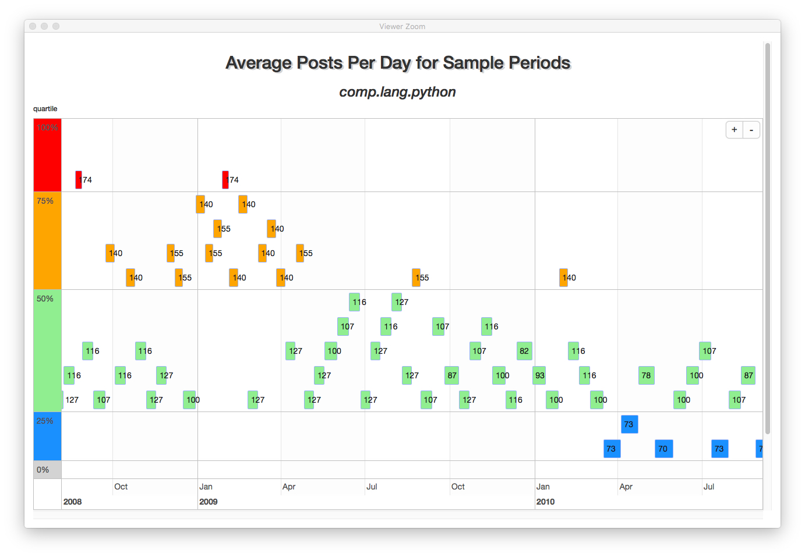
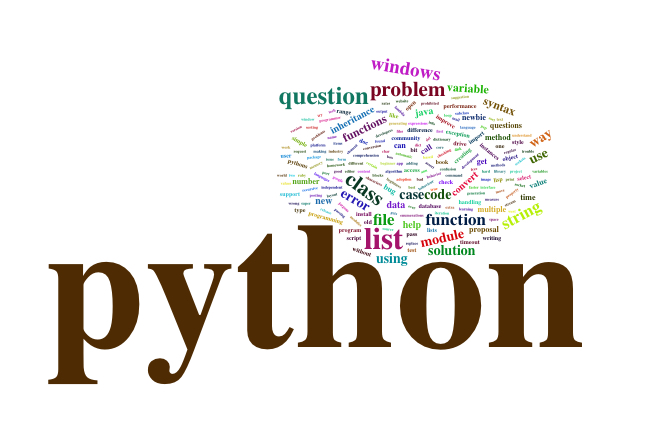

# nntpr

#### Rich Cotler
#### January, 2019

The nntpr R package is an in-progress project that I started with some
basic personal objectives in mind:

* learn how to develop R packages
* develop some simple nntp utility and analysis functions
* learn how to integrate python code and objects with R

The python integration was a side effect of my choice of working with nntp. I didn't run across any native NNTP protocol libraries or methods in R, but base python has an nntplib that fit the bill nicely.  I know I could have written the equivalent of nntpr completely in python, but that wouldn't have satisfied my first objective.

The application runs in R Studio It is written in
R (developed using version 3.5.1) and requires installation of the following CRAN libraries:

    R.utils,
    htmltools,
    htmlwidgets,
    purrr,
    readr,
    reticulate,
    rlist,
    stats,
    stringr,
    timevis,
    uuid

The first functions to use out of the gate are:

connect - log on to a usenet server

	`myconn = connect("news.example.nntpserver.com", "8080", "exampleu", "examplep!", "True")`

select a newsgroup to examine 

	`group("comp.lang.python")`

which returns

`[1] "211"              "536051"           "2"                "536052"           "comp.lang.python"`  
The group information vector (above) contains:

	nntp server response (211)  
	total articles in the newsgroup (536,051)  
	first article number (2)  
	last article number (536052)
	the name of the newsgroup (comp.lang.python)(

While there are a number of lower level functions that interface with the python nntplib, I wrote a function that uses nntpr to produce an example report on the characteristics of a chosen newsgroup.  See the groupdatevolume function documentation for details.  

Here's an example of groupdatevolume function reports for comp.lang.python:

`myreports <- groupdatevolume(wordcloud = TRUE)`

`myreports[[1]]`

`myreports[[2]]`

This is a work in progress.  More functionality and documentation as time permits.
